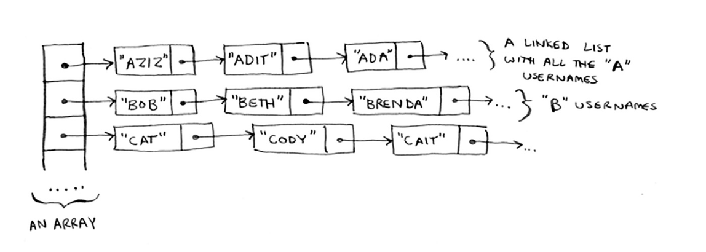

# Chapter 2 Exercise

## Solve
> [1] Suppose you're building an app to keep track of your finances.
Every day, you write down everything you spent money on. At the
end of the month, you review your expenses and sum up how much
you spent. So, you have lots of inserts and a few reads.  Should you
use an array or a list?
```
we should use a list 
because you will insert a lot of elements everyday and read every month
list  -> insert: O(1)
array -> insert: O(n)
```

> [2] Suppose you're building an app for restaurants to take customer
orders. Your app needs to store a list of orders. Servers keep adding
orders to this list, and chefs take orders off the list and make them.
It's an order queue: servers add orders to the back of the queue, and
the chef takes the first order off the queue and cooks it.
Would you use an array or a linked list to implement this queue?

```
we should use a linked list
because there is a lot of insertion and deletion.
linked list -> insert or delete : O(1)
and chef always takes the first order -> O(1)
```

> [3] Let's run a thought experiment. Suppose Facebook keeps a list of
usernames. When someone tries to log in to Facebook, a search is
done for their username. If their name is in the list of usernames,
they can log in. People log in to Facebook pretty often, so there are
a lot of searches through this list of usernames. Suppose Facebook
uses binary search to search the list. Binary search needs random
access. you need to be able to get to the middle of the list of
usernames instantly. Knowing this, would you implement the list
as an array or a linked list?
```
sorted array. Arrays give you random access 
you can get an element from the middle of the array instantly.
You can't do that with linked lists. O(n) "Sequential access"
```

> [4] People sign up for Facebook pretty often, too.
Suppose you decided to use an array to store the list of
users. What are the downsides of an array for inserts? In
particular, suppose you're using binary search to search
for logins. What happens when you add new users to an
array?
```
Inserting into arrays is slow. O(n)
So every insert will take a lot of time.
if we use binary search array must be sorted
so every time you need to insert you need to sort array too.
```

> [5] In reality, Facebook uses neither an array nor a
linked list to store user information. Let's consider a
hybrid data structure: an array of linked lists. You have
an array with 26 slots. Each slot points to a linked list. For
example, the first slot in the array points to a linked list
containing all the usernames starting with a. The second
slot points to a linked list containing all the usernames
starting with b, and so on.

Suppose Adit B signs up for Facebook and you want to
add them to the list. You go to slot 1 in the array, go to
the linked list for slot 1, and add Adit B at the end. Now,
suppose you want to search for Zakhir H. You go to slot
26, which points to a linked list of all the Z names. Then
you search through that list to find Zakhir H. Compare
this hybrid data structure to arrays and linked lists. Is it
slower or faster than each for searching and inserting?
You don't have to give Big O run times, just whether the
new data structure would be faster or slower.
```
for searching array is the fastest because linked list is O(n) 
and array of linked list will be O(n) but it still faster than linked list
for inserting array of linked list is the fastest O(1) then linked list O(1) then array O(n)
why array of linked list is faster than linked list?
because you broke down a long linked list to 26 smaller ones so access time decreases and so on.
```