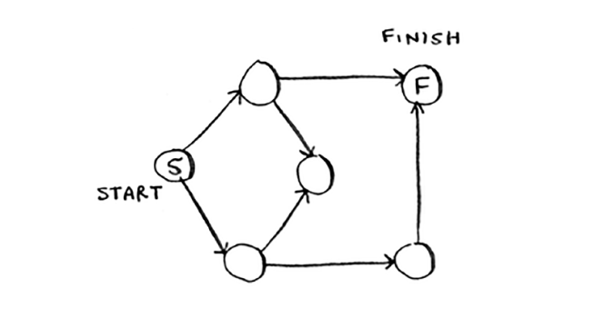
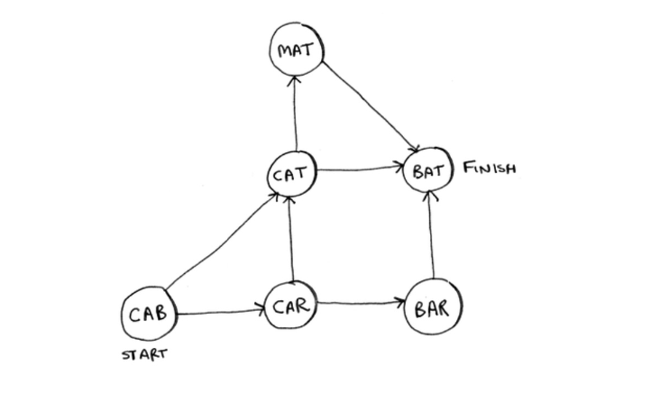
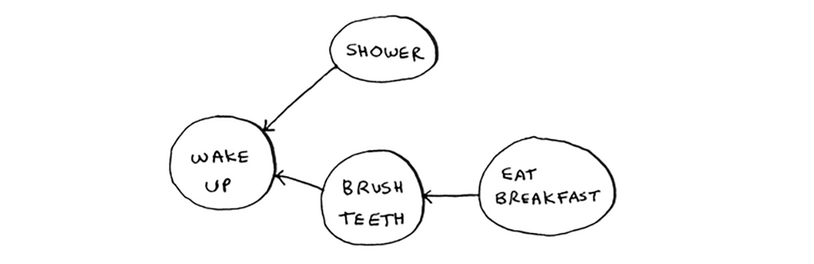
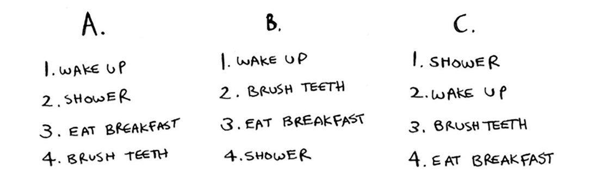
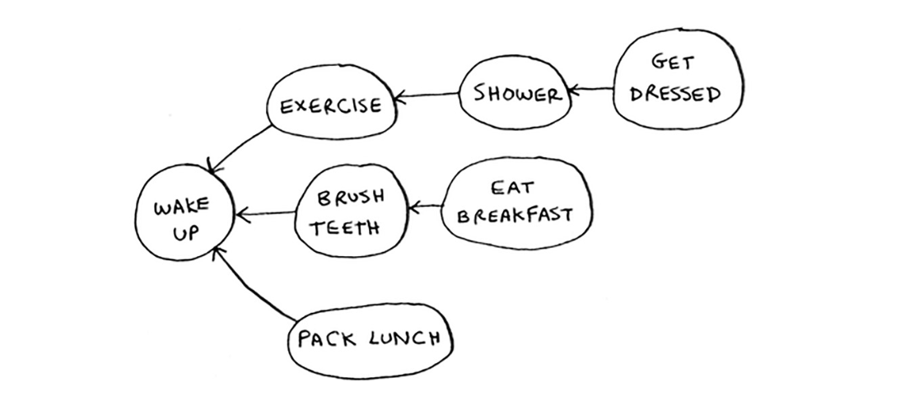
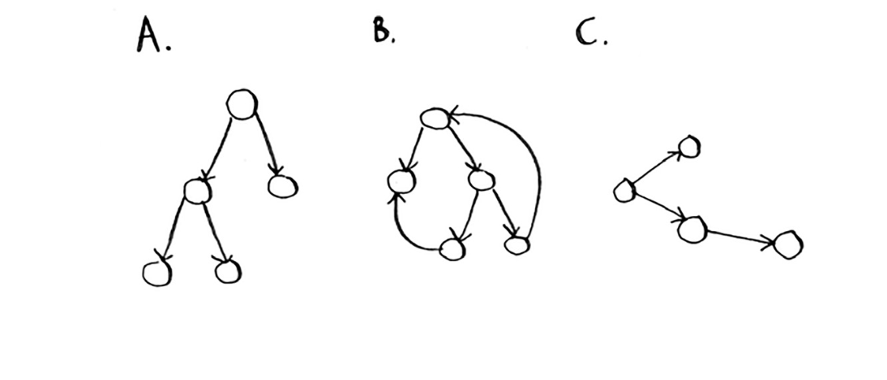

# Chapter 5 Exercise

## Run the breadth-first search algorithm on each of these graphs to find the solution.
> [1] Find the length of the shortest path from start to finish.

```
shortest path has two steps
```

> [2] Find the length of the shortest path from "cab" to "bat".

```
shortest path has length of two
CAB -> CAT > BAT
```

## Solve
> [3] Here's a small graph of my morning routine.

For these three lists, mark whether each one is valid or invalid.

```
A -> Invalid
B -> Valid
c -> Invalid
```

> [4] Here's a larger graph. Make a valid list for this graph.

```
list could be ["Wake up", "Exercise", "Brush teeth", "Shower", "Get dressed", "Eat Breakfast", "Pack Lunch"]
```

> [5] Which of the following graphs are also trees?

```
A -> Tree
B -> Not Tree
C -> Tree
```